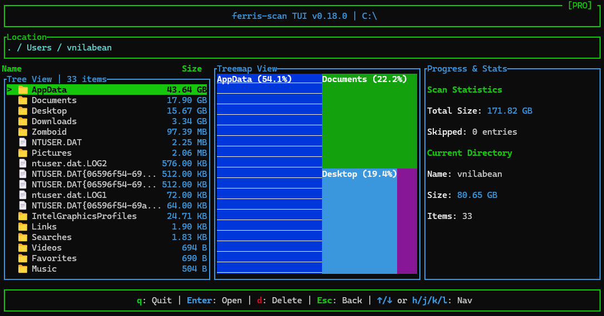
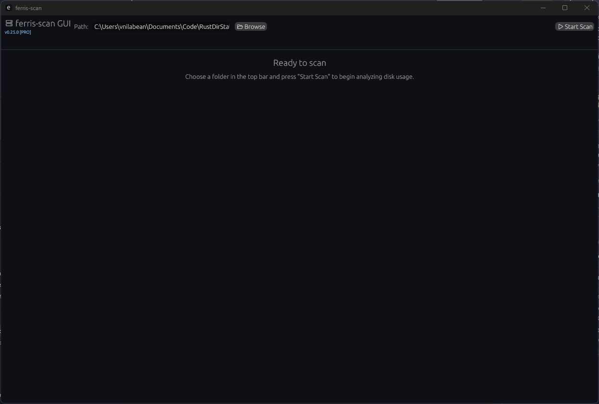

```
  ███████╗███████╗██████╗ ██████╗ ██╗███████╗      ███████╗ ██████╗ █████╗ ███╗   ██╗
  ██╔════╝██╔════╝██╔══██╗██╔══██╗██║██╔════╝      ██╔════╝██╔════╝██╔══██╗████╗  ██║
  █████╗  █████╗  ██████╔╝██████╔╝██║███████╗█████╗███████╗██║     ███████║██╔██╗ ██║
  ██╔══╝  ██╔══╝  ██╔══██╗██╔══██╗██║╚════██║╚════╝╚════██║██║     ██╔══██║██║╚██╗██║
  ██║     ███████╗██║  ██║██║  ██║██║███████║      ███████║╚██████╗██║  ██║██║ ╚████║
  ╚═╝     ╚══════╝╚═╝  ╚═╝╚═╝  ╚═╝╚═╝╚══════╝      ╚══════╝ ╚═════╝╚═╝  ╚═╝╚═╝  ╚═══╝
```

# ferris-scan

A high-performance disk usage analyzer for Windows, written in Rust. Designed as a lightweight, multi-threaded alternative to WinDirStat and TreeSize.

[](LICENSE)
[](https://www.microsoft.com/windows)
[](https://github.com/sponsors/vnilabean)

[](https://ko-fi.com/vnilabean)

---

## Overview

`ferris-scan` addresses the performance bottlenecks found in legacy disk analysis tools. By leveraging modern parallel filesystem traversal (`jwalk`) and a thread-safe architecture (`rayon`), it aims to saturate I/O bandwidth on NVMe drives while maintaining a minimal memory footprint (<100MB RAM).

**Key Capabilities:**
* **Parallel Traversal:** Multi-threaded scanning utilizing available CPU cores.
* **Memory Efficiency:** Optimized tree structures to handle millions of files with low overhead.
* **Treemap Visualization:** TreeSize-style view of space usage for the current directory in both TUI and GUI.
* **Terminal UI:** A keyboard-driven TUI built with `ratatui` for headless or low-resource environments.
* **No Runtime Dependencies:** Compiled native binary with no reliance on .NET or Electron.

**TUI treemap view:**



**GUI demo:**



---

## Installation

### Option A: Pre-built Installer (Recommended)
For users who want a signed Windows installer with automatic updates.

[**Download Installer ($5)**](https://ferris-scan.lemonsqueezy.com)

*Proceeds support development and maintenance.*

### Option B: Build from Source
The entire project is open source under the MIT license. You can compile the full version (including export features) directly from this repository.

**Prerequisites:**
* Rust 1.75+ ([Install via Rustup](https://rustup.rs/))

**Build Instructions:**

```bash
git clone [https://github.com/vnilabean/ferris-scan.git](https://github.com/vnilabean/ferris-scan.git)
cd ferris-scan

# Build the release binary (includes pro features)
cargo build --release --features pro --bin ferris-scan-tui

# The binary is now available in target/release/
cd target/release

# Run the analyzer
./ferris-scan-tui
```

## Architecture

The project follows a "Core + Frontend" architecture to separate scanning logic from the user interface.

### Core Library

`lib.rs`: Contains the Scanner struct, thread pool management, and data structures.

### Terminal User Interface

`bin/tui.rs`: The Terminal User Interface implementation.

Comparison run on a Samsung 980 PRO NVMe (1TB capacity, ~250GB used).

| Tool           | Scan Time | Memory Usage | Binary Size | Architecture      |
|----------------|-----------|--------------|-------------|-------------------|
| ferris-scan    | 5.2s      | 78 MB        | 2.6 MB      | Rust (Parallel)   |
| WizTree        | 3.8s      | 180 MB       | 4.2 MB      | MFT Parsing       |
| TreeSize Free  | 12s       | 95 MB        | 38 MB       | C++ / GUI         |
| WinDirStat     | 58s       | 220 MB       | 1.8 MB      | C++ (Sequential)  |

Note: MFT parsing support for ferris-scan is currently in development (v0.8).

## Usage

Basic Scan:
```bash
./ferris-scan-tui "C:\Users"
```

Controls:
* Arrow Keys: Navigate the file tree (In Progress)
* E: Export results to CSV
* Esc / Q: Quit

### Visualizing Space Usage (Treemap)

After a scan completes, both the TUI and GUI frontends show a **treemap pane** for the currently selected directory:

- **Each tile** represents a child file or folder, sized by its disk usage.
- **Colors** distinguish directories from files.
- **Percentages** indicate how much of the current directory each item consumes.

In the TUI, the treemap updates as you move the selection and drill up/down. In the GUI, the treemap updates as you browse using the tree view.

CSV Export: The application generates a structured CSV file suitable for automation or analysis in Python/Excel.

```csv
Path,Name,Type,Size (bytes)
Documents,Documents,Directory,52428800
Documents\Logs,Logs,Directory,102400
...
```

## Roadmap

```
    [x] Multi-threaded scanning engine (jwalk)

    [x] Basic TUI implementation (ratatui)

    [x] CSV Export functionality

    [x] Permission error handling

    [x] v0.2: Interactive tree navigation (Drill down/up)

    [x] v0.2: File deletion interface

    [x] v0.25: GUI Overhaul (Modern theme, Vector icons, Better layout)

    [ ] v0.4: Linux/macOS compatibility polish

    [ ] v0.x: Sunburst Chart Visualization

    [ ] v0.x: File Search & Filter

    [ ] v0.x: Stale File Analysis (Heatmap)

    [ ] v0.x: File Type Breakdown (Pie Chart)

    [ ] v0.8: Direct NTFS MFT Parsing (Driver-level scanning)

```

## License

This project is licensed under the MIT License.